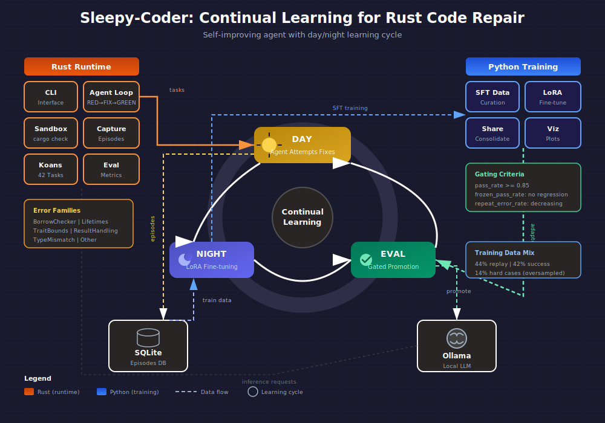
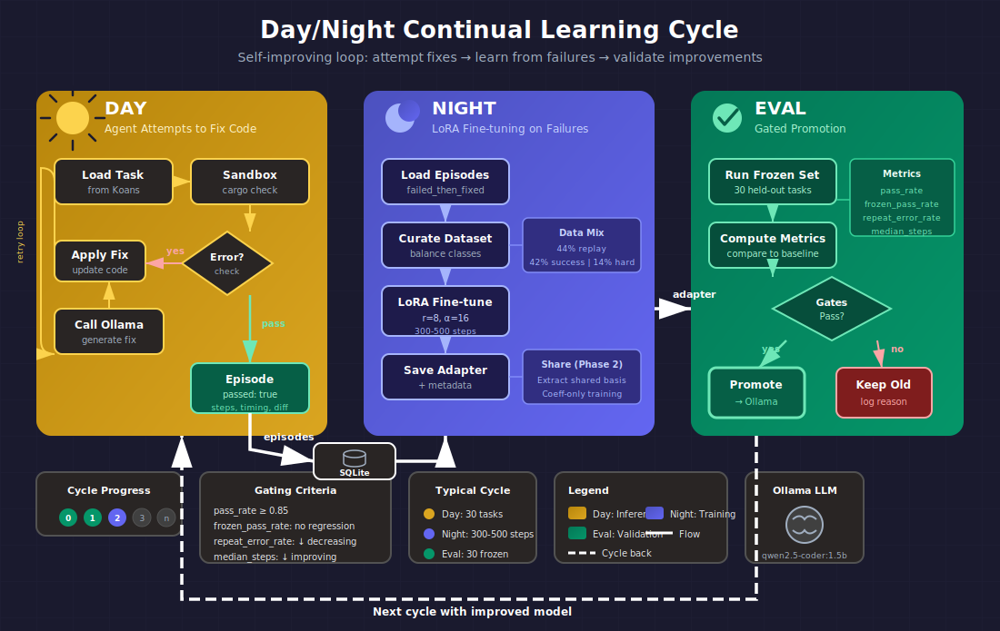
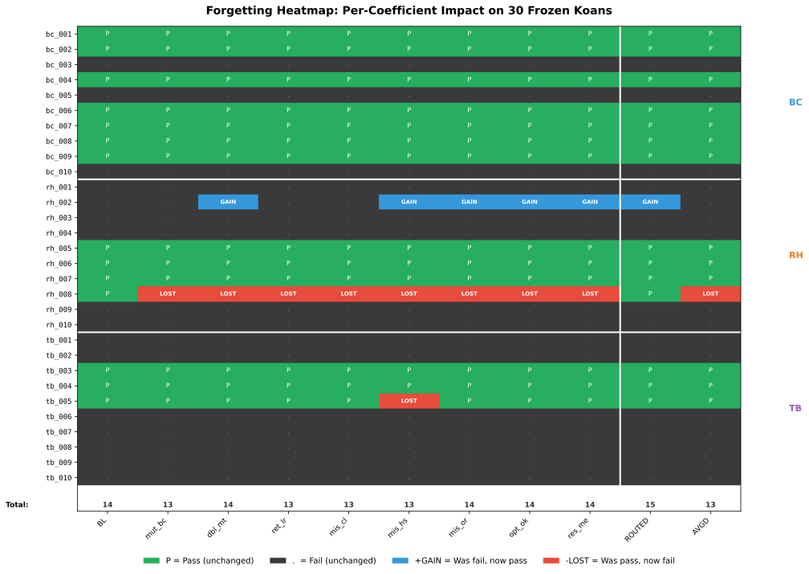
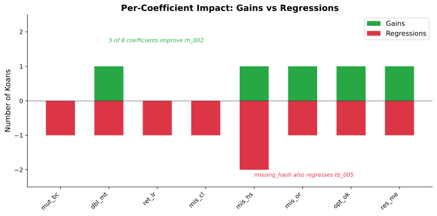
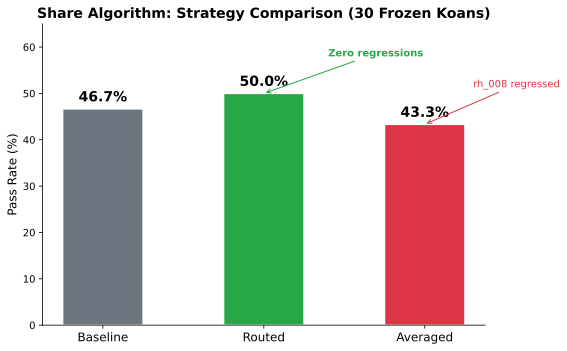
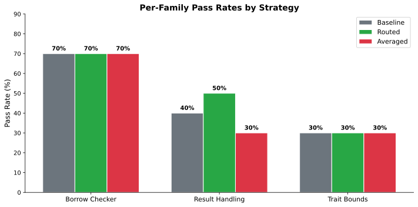

# sleepy-coder

A continual learning agent for fixing Rust code errors. The agent learns from its mistakes overnight using Parameter-efficient Continual Training (PaCT) methods.

## Overview

sleepy-coder operates in a day/night cycle:
- **Day**: Agent attempts to fix Rust compilation errors, recording episodes
- **Night**: Failed episodes are used to fine-tune the model with LoRA
- **Eval**: Progress is tracked on a frozen evaluation set





## Resources

[](https://www.youtube.com/watch?v=YhAbOvWEkzE&list=PLKjvVAEaR4itVMSjbcZ6PTS0bpnQ-NpIv)

*Video Explainer*

**Blog Posts:**
- [Sleepy Coder: When Fine-Tuning Fails](https://software-wrighter-lab.github.io/2026/02/12/sleepy-coder-when-fine-tuning-fails/)
- [Sleepy Coder: Routing Prevents Forgetting](https://software-wrighter-lab.github.io/2026/02/18/sleepy-coder-routing-prevents-forgetting/)

## Quick Start

```bash
# Build the project
cd rust && cargo build --release

# List available koans (coding tasks)
cargo run -- list

# Run agent on 5 borrow checker koans
cargo run -- run --count 5 --family borrow

# Run evaluation on the frozen eval set
cargo run -- eval --cycle 0

# Show a specific koan
cargo run -- show bc_001
```

## Requirements

- Rust 2024 edition (nightly)
- Ollama with a coding model (default: `qwen2.5-coder:1.5b-instruct-q4_K_M`)

```bash
# Install the default model
ollama pull qwen2.5-coder:1.5b-instruct-q4_K_M
```

## Project Structure

```
sleepy-coder/
├── rust/                    # Rust workspace
│   └── crates/
│       ├── core_types/      # Episode, Task, EvalResult types
│       ├── capture/         # SQLite episode storage
│       ├── sandbox/         # Isolated cargo check/test
│       ├── tasks_rust_koans/# 42 builtin coding tasks
│       ├── agent/           # LLM client and agent loop
│       ├── eval/            # Evaluation harness
│       └── cli/             # Command-line interface
├── py/                      # Python package (Phase 2)
│   └── sleepy_pact/         # LoRA training pipeline
├── data/                    # Data directories
│   ├── koans/               # Additional koan definitions
│   ├── episodes/            # Captured learning episodes
│   └── evalsets/            # Evaluation datasets
├── scripts/                 # Helper scripts
└── docs/                    # Documentation
```

## CLI Commands

### run

Run the agent on koans:

```bash
sleepy-coder run [OPTIONS]

Options:
  -c, --count <N>        Number of koans to run (default: all)
  -f, --family <FAMILY>  Filter by error family
  -a, --max-attempts <N> Max fix attempts per task (default: 5)
  -m, --model <MODEL>    LLM model to use
      --run-id <ID>      Run ID for tracking
```

### eval

Run evaluation on the frozen eval set:

```bash
sleepy-coder eval [OPTIONS]

Options:
  -c, --cycle <N>        Cycle number for tracking (default: 0)
  -a, --max-attempts <N> Max fix attempts per task (default: 5)
  -m, --model <MODEL>    LLM model to use
```

### list

List available koans:

```bash
sleepy-coder list [OPTIONS]

Options:
  -f, --family <FAMILY>  Filter by error family
  -v, --verbose          Show detailed information
```

### show

Show a single koan by ID:

```bash
sleepy-coder show <ID>
```

## Error Families

The koans are organized by error type:

| Family | Description | Count |
|--------|-------------|-------|
| borrow_checker | Moved values, borrows | 10 |
| lifetimes | Lifetime annotations | 6 |
| trait_bounds | Missing trait implementations | 10 |
| result_handling | Result/Option misuse | 10 |
| type_mismatch | Type errors | 6 |

## Development

```bash
# Run all tests
./scripts/test-all.sh

# Run linting (clippy, fmt, markdown)
./scripts/lint.sh

# Build all crates
./scripts/build-all.sh

# Quick development cycle
./scripts/quick-cycle.sh
```

## Experiment Results

### Share Algorithm: Routing Prevents Catastrophic Forgetting

We implemented the [Share](https://arxiv.org/html/2602.06043v1) algorithm for continual learning:
Phase 1 extracts a shared SVD basis from LoRA adapters, Phase 2 trains only
small coefficient matrices (83K params) per task with the basis frozen.

Evaluated on 30 frozen koans (10 borrow checker, 10 result handling, 10 trait bounds),
single-shot inference, no prompt hints, HuggingFace bf16:

| Strategy | Pass Rate | BC | RH | TB | Regressions |
|----------|-----------|----|----|----|----|
| Baseline (no LoRA) | 46.7% | 70% | 40% | 30% | -- |
| Averaged (all coefficients) | 50.0% | 70% | 40% | 40% | 1 |
| **Routed (pattern-matched)** | **50.0%** | **70%** | **50%** | **30%** | **0** |

### Forgetting Heatmap

Each v4 coefficient applied **individually to all 30 koans** to measure interference:



### Per-Coefficient Impact



### Strategy Comparison



### Per-Family Breakdown



For full results with raw data, see [docs/results.md](docs/results.md).

### Conclusions

1. **Routing prevents forgetting.** rh_008 regresses under every single coefficient
   applied globally, but routing **saves it** by falling back to base model when
   no pattern matches. The routing mechanism is essential.

2. **Gradient-trained coefficients work.** Earlier analytical projection (Phase 1 only)
   caused regressions (43.3%). Proper Phase 2 gradient training with LoRA-style
   initialization eliminated regressions entirely.

3. **Result handling improved.** Routed RH went from 40% to 50% -- the first
   positive transfer from Share coefficients.

4. **Key bug fixes required.**
   - Zero-init saddle point: `eps_beta=0, eps_alpha=0` gives `delta_W = 0 @ 0`
     with zero gradients. Both need small random init.
   - Half-param training: LoRA-style init (one zero, one random) only trains
     one parameter set. Dual random init trains all 224/224 params.

5. **Prompt engineering still wins overall** (83.3% with error hints vs 50% without),
   but Share routing is the path to continual improvement on truly new patterns
   (Rust 2024 edition, custom coding standards).

## Key Metrics

The agent tracks these metrics across training cycles:

- **Repeat Error Rate**: Fraction of tasks failing with same error as before (target: <20%)
- **Median Steps to Green**: Median attempts to fix (target: <3.0)
- **Frozen Pass Rate**: Pass rate on held-out eval set (target: >90%)

## Research Background

Based on two key papers:
- [Share LoRA Subspaces](https://arxiv.org/html/2602.06043v1) - Shared low-rank subspace for continual learning
- [UWSH](https://arxiv.org/abs/2512.05117) - Universal Weight Subspace Hypothesis

## License

See [LICENSE](LICENSE) for details.
