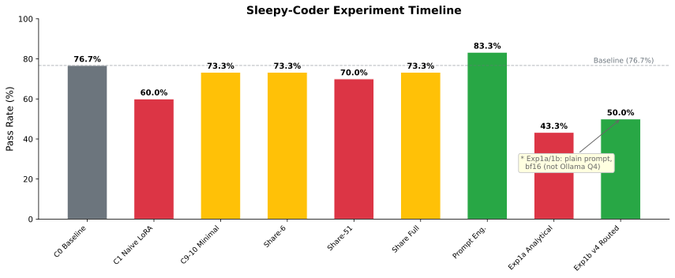

# Sleepy-Coder Evaluation Results

*Last Updated: 2026-02-17*

## Experiment Timeline

All experiments evaluated on 30 frozen koans (10 borrow checker, 10 result handling, 10 trait bounds).



| Cycle | Date | Approach | Pass Rate | Notes |
|-------|------|----------|-----------|-------|
| C0 | 02-08 | Baseline (Ollama Q4) | 76.7% | Initial target |
| C1 | 02-08 | Naive LoRA | 60.0% | Catastrophic forgetting |
| C9-10 | 02-09 | Minimal (20 steps) | 73.3% | Best fine-tuned |
| C12 | 02-09 | Rust 2024 | 73.3% | Same ceiling |
| C13 | 02-09 | Share (6 adapters) | 73.3% | Proper implementation |
| C14+ | 02-10 | Share (51 adapters) | 70.0-73.3% | More adapters = worse |
| Final | 02-10 | Share Full (Ph2+Ph3) | 73.3% | Prevents forgetting, no improvement |
| C100-102 | 02-12 | **Prompt Engineering** | **80-86.7%** | Error-specific hints work! |
| Exp 1a | 02-17 | Share Routing (analytical) | 43-50%* | Analytical coefficients hurt |
| **Exp 1b** | **02-17** | **Share Routing (v4 trained)** | **50%*** | **Zero regressions, RH +10%** |

*\* Exp 1a/1b use plain prompts + HuggingFace bf16 (not Ollama Q4), so pass rates are not directly comparable to C0-C102.*

---

## Share Algorithm: Routing vs Averaging (Experiment 1b)

The [Share algorithm](https://arxiv.org/html/2602.06043v1) extracts a shared SVD basis from LoRA adapters, then trains small coefficient matrices (83K params) per error pattern. We tested three strategies:


| Strategy | Pass Rate | BC (10) | RH (10) | TB (10) | Regressions |
|----------|-----------|---------|---------|---------|-------------|
| Baseline (no LoRA) | 46.7% (14/30) | 70% | 40% | 30% | -- |
| Averaged (all coefficients) | 43.3% (13/30) | 70% | 30% | 30% | 1 (rh_008) |
| **Routed (pattern-matched)** | **50.0% (15/30)** | **70%** | **50%** | **30%** | **0** |

### Per-Family Breakdown


- **Borrow Checker**: All strategies score 70% (7/10). BC koans are stable.
- **Result Handling**: Routing improved from 40% to 50% (+1 koan: rh_002). Averaging dropped to 30% (-1 koan: rh_008).
- **Trait Bounds**: Baseline 30%, unchanged by routing. Most TB errors don't match any trained coefficient.

---

## Forgetting Heatmap

Each v4 coefficient applied **individually to all 30 koans** to measure cross-task interference:


### ASCII Reference

```
Koan     BL  mut_bc dbl_mt ret_lr mis_cl mis_hs mis_or opt_ok res_me ROUTED AVGD
─────────────────────────────────────────────────────────────────────────────────
bc_001    P   P      P      P      P      P      P      P      P      P      P
bc_002    P   P      P      P      P      P      P      P      P      P      P
bc_003    .   .      .      .      .      .      .      .      .      .      .
bc_004    P   P      P      P      P      P      P      P      P      P      P
bc_005    .   .      .      .      .      .      .      .      .      .      .
bc_006    P   P      P      P      P      P      P      P      P      P      P
bc_007    P   P      P      P      P      P      P      P      P      P      P
bc_008    P   P      P      P      P      P      P      P      P      P      P
bc_009    P   P      P      P      P      P      P      P      P      P      P
bc_010    .   .      .      .      .      .      .      .      .      .      .
rh_001    .   .      .      .      .      .      .      .      .      .      .
rh_002    .   .     +GAIN   .      .     +GAIN  +GAIN  +GAIN  +GAIN  +GAIN   .
rh_003    .   .      .      .      .      .      .      .      .      .      .
rh_004    .   .      .      .      .      .      .      .      .      .      .
rh_005    P   P      P      P      P      P      P      P      P      P      P
rh_006    P   P      P      P      P      P      P      P      P      P      P
rh_007    P   P      P      P      P      P      P      P      P      P      P
rh_008    P  -LOST  -LOST  -LOST  -LOST  -LOST  -LOST  -LOST  -LOST   P    -LOST
rh_009    .   .      .      .      .      .      .      .      .      .      .
rh_010    .   .      .      .      .      .      .      .      .      .      .
tb_001    .   .      .      .      .      .      .      .      .      .      .
tb_002    .   .      .      .      .      .      .      .      .      .      .
tb_003    P   P      P      P      P      P      P      P      P      P      P
tb_004    P   P      P      P      P      P      P      P      P      P      P
tb_005    P   P      P      P      P     -LOST   P      P      P      P      P
tb_006    .   .      .      .      .      .      .      .      .      .      .
tb_007    .   .      .      .      .      .      .      .      .      .      .
tb_008    .   .      .      .      .      .      .      .      .      .      .
tb_009    .   .      .      .      .      .      .      .      .      .      .
tb_010    .   .      .      .      .      .      .      .      .      .      .
─────────────────────────────────────────────────────────────────────────────────
Total   14/30 13    14     13     13     13     14     14     14     15     13
```

Key: `P` = pass, `.` = fail, `+GAIN` = was fail now pass, `-LOST` = was pass now fail

### Per-Coefficient Impact


---

## Key Findings

### 1. Routing prevents forgetting

rh_008 regresses under **every single coefficient** applied globally, but routing **saves it** by falling back to the base model when no error pattern matches. The routing mechanism is essential for the Share algorithm to work.

### 2. Gradient-trained coefficients work (analytical projection does not)

Earlier analytical projection (Exp 1a, Phase 1 only) caused regressions (43.3%). Proper Phase 2 gradient training with dual-random initialization eliminated regressions entirely.

### 3. Result handling improved

Routed RH went from 40% to 50% -- the first positive transfer from Share coefficients. 5 of 8 coefficients independently improve rh_002, suggesting a shared beneficial direction in coefficient space.

### 4. Critical bugs fixed during Phase 2 training

| Bug | Symptom | Fix |
|-----|---------|-----|
| Zero-init saddle point | `delta_W = 0 @ 0` with zero gradients | Both eps_beta and eps_alpha need small random init |
| Half-param training | Only 112/224 params get gradients | Dual random init (not LoRA-style one-zero, one-random) |

### 5. Prompt engineering still wins for known patterns

83.3% with error hints vs 50% without. But Share routing is the path to continual improvement on truly novel patterns (Rust 2024 edition, custom coding standards) that can't be hardcoded into prompts.

---

## Phase 2 Training Configuration (v4 Coefficients)

| Parameter | Value |
|-----------|-------|
| Base Model | Qwen2.5-Coder-1.5B-Instruct (HuggingFace bf16) |
| Share Basis | SVD from 8 LoRA adapters |
| k_alpha | 174-176 (per-layer) |
| k_beta | 14 |
| p (coefficient rank) | 4 |
| Training Steps | 100 |
| Learning Rate | 1e-4 |
| Weight Decay | 0.01 |
| Batch Size | 4 |
| Trainable Params | ~83K (224 per layer, 28 layers) |
| Init | Dual random: randn * 0.01/sqrt(k) |

---

## Early Experiment Results (Ollama Q4)

These earlier experiments used Ollama with Q4 quantization and multi-turn agent loop (up to 5 attempts per koan). Not directly comparable to Exp 1a/1b above.

| Cycle | Model | Pass Rate | Passed | Failed | Median Steps |
|-------|-------|-----------|--------|--------|--------------|
| 0 | qwen2.5-coder:1.5b-instruct-q4_K_M | 76.7% | 23 | 7 | 2.0 |
| 1 | sleepy-coder-v2 (naive LoRA) | 60.0% | 18 | 12 | 2.0 |


---

## Raw Data

Forgetting analysis JSON: [forgetting_analysis.json](viz/forgetting_analysis.json)

```json
{"cycle": 0, "error_signatures": {"max_attempts_exceeded": 7}, "failed": 7, "median_steps_to_green": 2.0, "model": "qwen2.5-coder:1.5b-instruct-q4_K_M", "pass_rate": 0.7666666666666667, "passed": 23, "run_id": "eval_cycle0_20260209_035102"}
{"cycle": 1, "error_signatures": {"max_attempts_exceeded": 12}, "failed": 12, "median_steps_to_green": 2.0, "model": "sleepy-coder-v2", "pass_rate": 0.6, "passed": 18, "run_id": "eval_cycle1_20260209_035157"}
```
